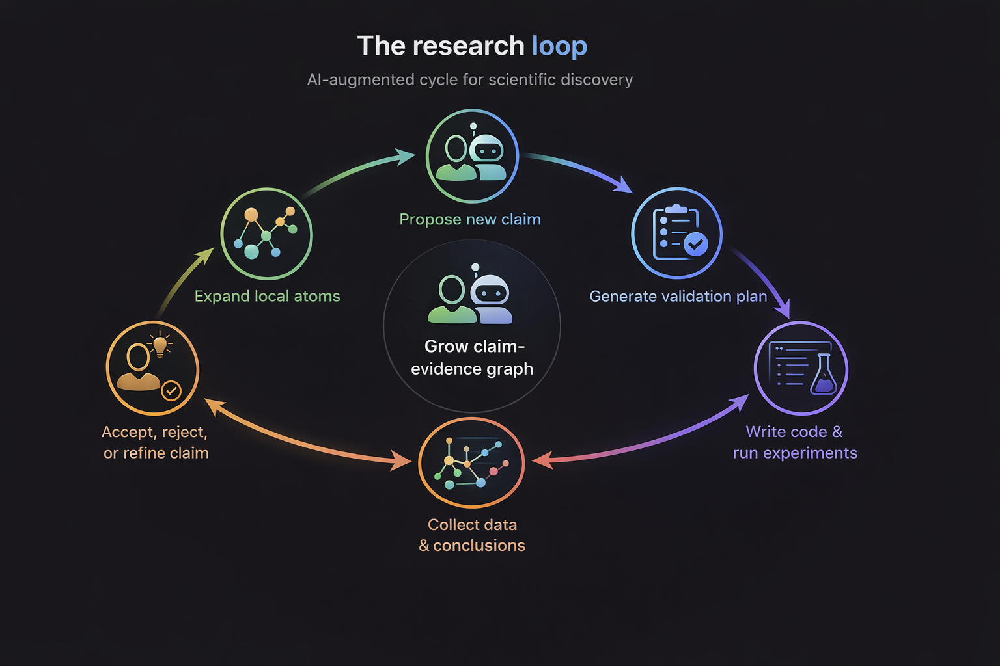
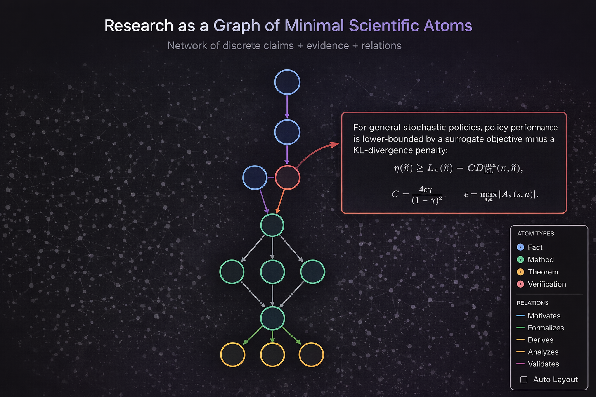

# [OpenResearch]

> **Research is not a single prompt. It is a growing graph of claims, evidence, and decisions.**

An open-source system for **AI-assisted AI/ML research**, built around a simple idea:

**Scientific progress should be decomposed into minimal, inspectable atoms — each atom is one `claim + evidence` pair — and research should be managed as the continuous expansion of an atom network.**

This project is not trying to make researchers disappear.

It is trying to make **research legible, persistent, auditable, and collaborable** — so that humans and AI can work together at the level where real science actually happens: not only at the paper level, but at the level of **micro-claims, micro-failures, micro-insights, and micro-decisions**.

---

## Why this exists

Most AI research tools treat research as a black-box pipeline:

**idea → code → experiments → paper**

That is useful, but it misses the thing that matters most in real research:

**the state of reasoning between those steps.**

A good research project is not just a sequence of outputs.
It is a structured, evolving network of:

* what we currently believe,
* why we believe it,
* what was tested,
* what failed,
* what remains uncertain,
* and what should happen next.

This project makes that hidden structure explicit.

---

## The core idea: atomize science

We model research as a graph of minimal scientific atoms.

Each atom contains:

* **Claim** — one precise scientific statement
* **Evidence** — derivation, experiment, observation, or result supporting that statement

And atoms are connected by typed relations such as:

* `motivates`
* `formalizes`
* `derives`
* `analyzes`
* `validates`
* `contradicts`

So instead of treating a paper as one giant blob, we treat it as a **living reasoning graph**.

That graph becomes the real state of the project.

---

## What this unlocks

### 1. Lower hallucination risk

AI is much more reliable when it is forced to operate on explicit, local objects instead of hand-waving over an entire research agenda.

By grounding every step in a concrete `claim + evidence` unit, the system is pushed toward:

* local reasoning,
* explicit justification,
* and inspectable failure.

Not perfect truth — but much better scientific discipline.

### 2. Persistent memory for long-horizon research

Real AI/ML research is messy and long-running.
Small insights are easy to lose. Dead ends repeat. Important partial progress disappears into notebooks, chats, and intuition.

This project turns those fragments into persistent structure:

* every micro-result can be stored,
* every claim can be revised,
* every validation can be traced,
* every new idea can attach to prior work.

The result is a research memory that compounds over time.

### 3. Fine-grained human–AI collaboration

The most valuable part of senior researchers is usually not raw execution.
It is taste, intuition, skepticism, and the ability to notice what matters.

Most “auto-research” systems only let humans intervene at coarse checkpoints.

This project instead lets humans collaborate with AI at the granularity of:

* one claim,
* one theorem,
* one design decision,
* one failed experiment,
* one suspicious result.

That is where expert intuition is strongest.

---

## The research loop

This project is designed around an iterative loop:

1. **Human or AI proposes a new claim**
2. **AI expands the local atom context**
3. **AI generates a validation plan**
4. **AI writes code and runs experiments**
5. **Evidence, metrics, and conclusions are attached back to the atom graph**
6. **Human accepts, rejects, refines, or splits the claim**
7. **The graph grows**
8. **The next claim emerges from the updated graph**

In other words:

> **Research is modeled as continuous graph expansion, not one-shot paper generation.**

---

## What makes this different

There are already systems aiming to automate research end-to-end.
FARS is one of the clearest examples.

Public material describes **FARS** as a **Fully Automated Research System**: an end-to-end AI research system operating at scale, intended to autonomously perform the research workflow, and recent automated-research reports describe it as a commercial platform targeting general scientific domains. ([Analemma][1])

That is an impressive direction.

But this project is optimizing for a different center of gravity.

### FARS optimizes for:

* end-to-end autonomy
* throughput
* broad automated execution
* idea-to-paper completion

### This project optimizes for:

* atomic provenance
* inspectable reasoning state
* persistent scientific memory
* human-in-the-loop control
* fine-grained steering of research

So the difference is not merely “more autonomous” vs “less autonomous”.

The deeper difference is:

> **FARS treats research as a pipeline to complete.**
> **This project treats research as a knowledge graph to build.**

That design choice matters.

Because for serious AI/ML research, the bottleneck is often not just execution.
It is maintaining a faithful representation of what has actually been learned.

---

## Why a graph instead of a paper-first workflow?

Because papers are the compression artifact.
Research is the underlying structure.

A paper hides:

* abandoned branches
* intermediate claims
* failed validations
* fragile assumptions
* alternative interpretations
* unresolved contradictions

But those are exactly the objects that matter when humans and AI are doing iterative discovery together.

The atom graph keeps them alive.

---

## Built for AI/ML research

This project is especially suited for AI/ML because the field naturally mixes:

* empirical claims
* algorithmic constructions
* theoretical guarantees
* implementation details
* benchmark-driven validation

We therefore model different logical layers explicitly, such as:

* **Fact claims**
* **Method claims**
* **Theorem claims**
* **Verification claims**

That means a theorem is not confused with a method.
A benchmark result is not confused with a background fact.
A design choice is not confused with its empirical validation.

This separation is what makes the graph actually useful.

---

## What the system should eventually become

Not just an “AI scientist”.

A **research operating system**.

A place where:

* ideas become claims,
* claims become executable validations,
* results become structured evidence,
* contradictions become visible,
* and the entire project stays navigable over months or years.

The long-term goal is not to replace researchers.

It is to build the infrastructure that lets human researchers and AI systems **co-discover** more effectively than either could alone.

---

## Current Vision

We envision a **research operating system** where humans and AI collaborate seamlessly, turning scientific ideas into structured knowledge and actionable insights. In this system, you can:

* **Ingest papers** and decompose them into minimal claim–evidence atoms
* **Build and maintain a persistent graph** of claims, evidence, methods, theorems, and validations
* **Propose new claims** from local graph context, guided by AI suggestions and human intuition
* **Automatically generate validation plans** and synthesize executable code from method atoms
* **Run experiments and simulations**, collecting structured evidence
* **Attach results back to the network**, preserving full provenance
* **Accept, reject, refine, or split claims**, supporting iterative discovery
* **Collaborate across teams**, allowing multiple researchers to interact with the graph in real time
* **Automatically generate drafts** for papers, reports, or presentations from the graph
* **Continuously grow a project-level research memory**, capturing all micro-progress and insights

> The goal is a **full-stack research ecosystem**: one that transforms ideas into structured knowledge, experimental evidence, and polished outputs, all while maintaining transparency, traceability, and human oversight.

## Why open source

Because research infrastructure should be inspectable too.

If the goal is trustworthy AI-assisted science, then the system itself should be:

* transparent,
* hackable,
* extensible,
* and owned by the community that uses it.

Open source is not just a distribution model here.
It is part of the epistemology.

---

## Who this is for

This project is for people who believe that the future of scientific AI is not just:

* “ask for a paper”
* “ask for an experiment”
* “ask for a result”

but:

* **build a persistent scientific state**
* **reason locally**
* **preserve uncertainty**
* **make progress inspectable**
* **let humans and AI collaborate at claim resolution**

---

## Status

Early, ambitious, and very much under construction.

But the thesis is simple:

> **The missing abstraction for AI-assisted research is not another writing agent.**
> **It is a durable graph of claims, evidence, and decisions.**

If that thesis is right, this project points toward a very different future for AI research tooling.

---

## Join us

If you care about:

* AI for science
* AI for AI research
* human–AI co-discovery
* structured scientific memory
* interpretable research agents
* long-horizon research workflows

then this project is for you.

Let’s stop treating research as a monolithic prompt.

Let’s build the graph.

---
